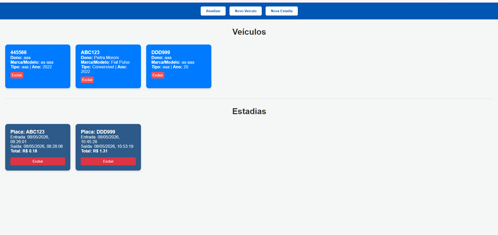
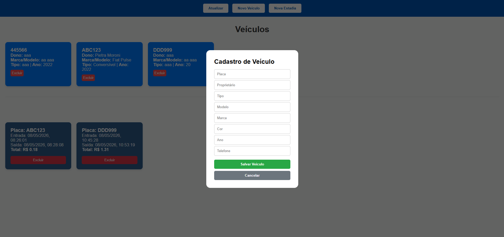
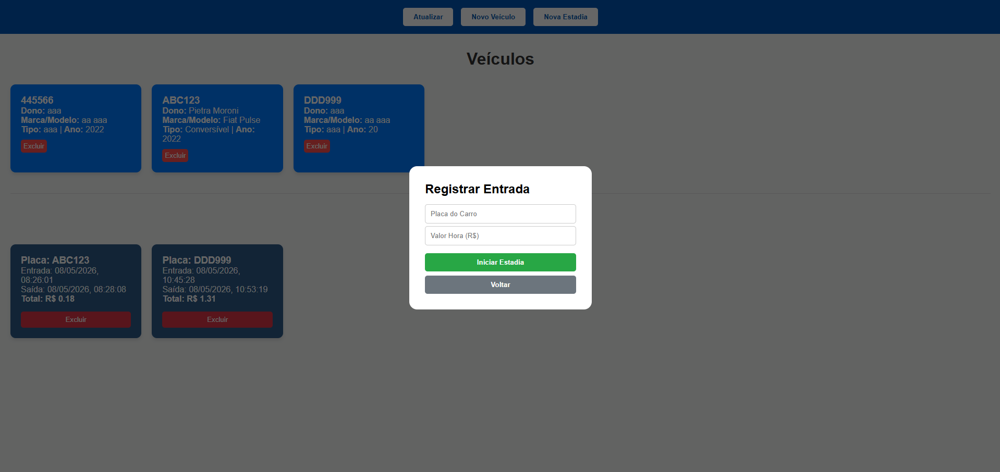
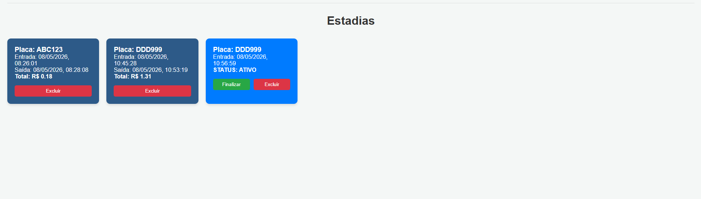
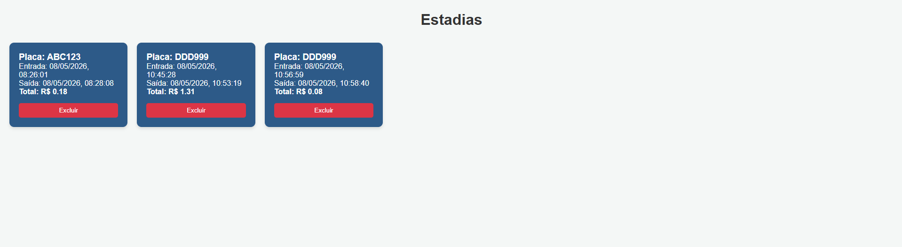

# Estacionamento - Sistema de Gestão

Sistema web para controle de fluxo de veículos em estacionamentos, permitindo o cadastro detalhado de frotas e o monitoramento de tempo de permanência com cálculo automático de valores.

## Demonstração

| Tela Inicial | Cadastro de Veículos |
|---|---|
|  |  |

| Cadastro de Estadias | Estadia em Andamento |
|---|---|
|  |  | 

| Estadia Finalizada |
|---|
| |

---

## Funcionalidades

- **Módulo de Veículos**:
  - Cadastro completo seguindo rigorosamente os requisitos da API.
  - Listagem de veículos com visualização de proprietário e marca.
  - Exclusão de veículos cadastrados.
- **Módulo de Estadias**:
  - Registro de entrada vinculada à placa.
  - Botão de **Finalizar** direto no card (registra saída e calcula valor).
  - Diferenciação visual: Estadias finalizadas ficam em **azul**.
  - Exclusão de registros de histórico.


##  Como Testar o Projeto

Para garantir que a integração entre o Front-end e o Back-end está funcionando perfeitamente, siga estes passos:

### 1. Testando a API (Via Insomnia ou Postman)

Para validar se o seu servidor aceita os campos exatamente como solicitado, envie um **POST** para:
`http://localhost:3000/automovel/cadastrar`

**Corpo da Requisição (JSON):**

```json
{
  "placa": "AAA2222",
  "proprietario": "Pietra Moroni",
  "tipo": "Carro",
  "modelo": "Pulse",
  "marca": "Fiat",
  "cor": "Cinza Escuro",
  "ano": 2022,
  "telefone": "11 89563201"
}

```

### 2. Testando o Fluxo no Front-end

1. **Cadastro de Veículo:** Abra o `index.html`, clique em **Novo Veículo**, preencha os dados e salve. Verifique se o card aparece na lista superior.
2. **Entrada de Estadia:** Clique em **Nova Estadia**, insira a placa cadastrada e defina um valor hora (ex: 10.00).
3. **Saída (Cálculo):** No card da estadia que acabou de ser criada, clique no botão **Finalizar**.
* O sistema deve registrar a hora atual.
* O card deve mudar para a cor **azul**.
* O valor total deve aparecer calculado (Valor Hora × Tempo de Permanência).


4. **Exclusão:** Teste os botões de excluir tanto no veículo quanto na estadia para limpar o banco de dados.

### 3. Verificação de Console

Pressione `F12` no navegador e vá em **Console**. Se algum dado não salvar, o erro aparecerá ali (geralmente erros de CORS ou campos faltando no JSON).

---

## Configuração e Instalação

1. **Clone este repositório**:
```bash
git clone https://github.com/seu-usuario/seu-repositorio.git

```


2. **Servidor (Back-end)**: Certifique-se de que a API está rodando na porta `3000`.
3. **Cliente (Front-end)**: Abra o arquivo `index.html` diretamente no seu navegador.

---

Projeto desenvolvido para fins educacionais por Pietra Moroni.

